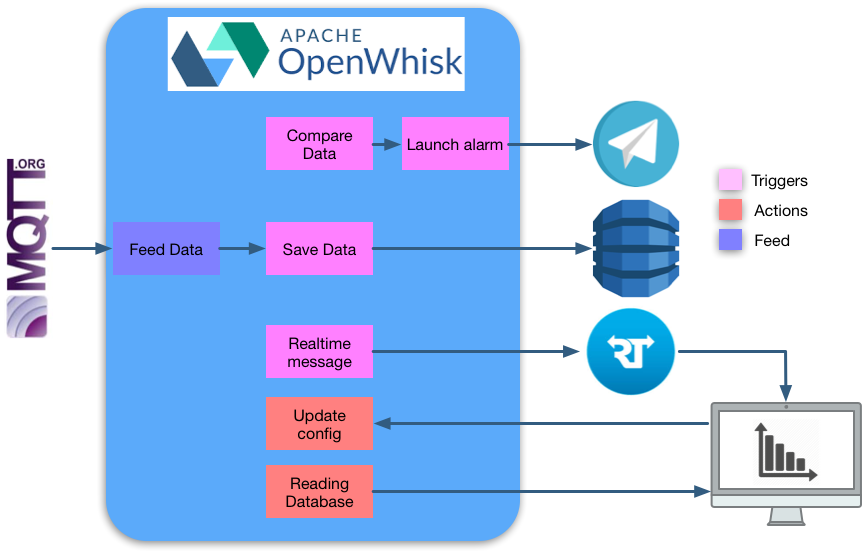
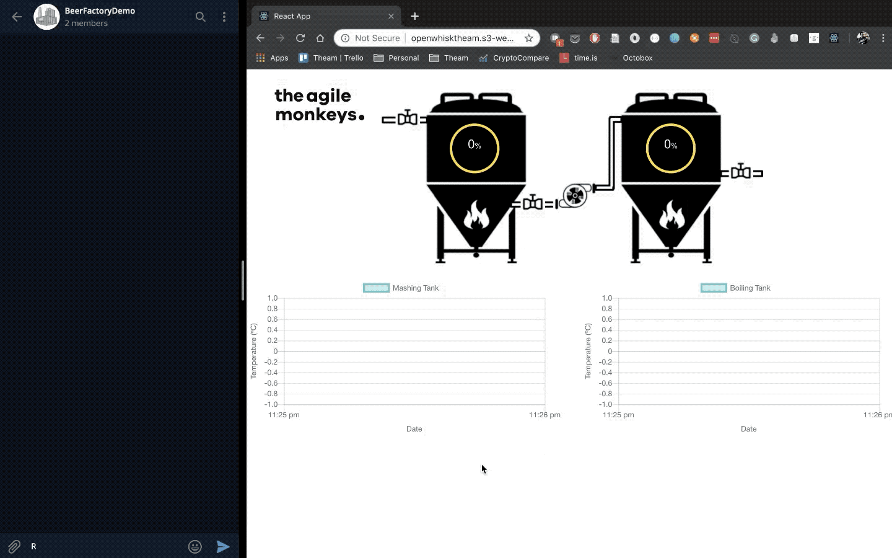

# OpenWhisk :heart: Rust and IoT applications

## Introduction

This repo is a demo to explore the use of OpenWhisk in combination with Rust to develop Internet of Things (IoT) applications. The proposed architecture for the whole system is the following:



The main idea is simulate the process of brew beer in a factory with two temperature controlled boilers and all the pumps involved to transfer the beer wort. More information about this project can be found in this article: 

:construction::construction_worker: **work in progress** :construction_worker::construction:

## Runbook

### Running requirements

Of course you need an OpenWhisk instance running locally or on the cloud to run the application. You also need the Rust and Cargo configured in your machine. These configurations of are out of the scope of this document.

### Set your environmental variables

In order to run this project some enviromental variables are needed:

```bash
#AWS CONFIGURATION
export AWS_ACCESS_KEY_ID=YOUR_AWS_ACCESS_KEY_ID_FOR_DYNAMO_DB
export AWS_SECRET_ACCESS_KEY=YOUR_AWS_SERCRET_KEY
# REAL TIME CONFIGURATION
export RT_APP=YOUR_REAL_TIME_APP_ID
export RT_SECRET=YOUR_REAL_TIME_SECRET
#TELEGRAM CONFIGURATION
export TELEGRAM_API_KEY=TELEGRAM_BOT_API_KEY
export TELEGRAM_CHANNEL=TELEGRAM_BOT_CHANNEL_ID
#OPENWHISK CONFIGIRATION
export OPENWHISK_URL=url_to_your/triggers/commandSaveMeasurement?blocking=true
export OPENWHISK_USER=YOUR_OPENWHISK_USER
export OPENWHISK_PASSWORD=YOUR_OPENWHISK_PASSWORD
```

### Deploy all the functions and triggers

The project includes a one-click deploy script under `demo_openWhisk/deploy.sh` this script compiles the Rust code into the proper architecture and create are the functions and triggers inside OpenWhisk. This script is also prepared to deploy automatically all the application into blue mix using the option --bluemix. In order to one-click deploy on bluemix you need to have configured the bluemix CLI. 

### Start locally the React Dashboard

Under the folder `/front` is all the code for the react front. In order to un it you only need to execute `npm start` and the browser will be opened at `http://localhost:3000`

### Start to generate mock data 

The project also includes a simple mock application to dispatch sample data to the app. in order to run it you only need to go to `/mock_data` and execute `cargo run`. This simple script will start to dispatch events to OpenWhisk simulating the data generation from a MQTT bridge. The following animation shows the whole system working. The telegram channel (On the left) and the React dashboard (on the right) are receiving data generated with the MQTT bridge mock

